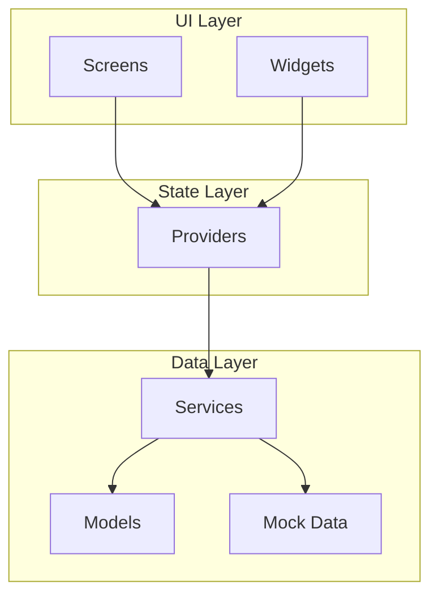

# EcoTrack – Carbon Footprint Assistant

A cross-platform Flutter app that allows users to calculate, track, and reduce their carbon emissions through smart insights, gamification, and a premium dashboard.

## User Review Required

> [!IMPORTANT]
> **Firebase Configuration**: Since Firebase requires project-specific `google-services.json` (Android) and `GoogleService-Info.plist` (iOS) files, I will implement the app with **mock authentication and mock Firestore services** that mirror the Firebase API. This allows the app to run immediately without Firebase setup. The services are structured so you can swap in real Firebase with minimal changes later.

> [!IMPORTANT]
> **State Management**: I'll use **Provider** (simpler, well-documented) rather than Riverpod. Let me know if you prefer Riverpod.

> [!IMPORTANT]
> **Local Storage**: I'll use **SharedPreferences** for simple key-value persistence and **JSON file storage** for activity logs. This avoids Hive's code generation complexity while keeping the app immediately runnable.

---

## Proposed Changes

### Phase 1: Project Scaffold & Design System

#### [NEW] Flutter project (`flutter create`)
- Create the Flutter project in the workspace directory
- Configure `pubspec.yaml` with dependencies: `provider`, `fl_chart`, `shared_preferences`, `intl`, `google_fonts`

#### [NEW] [theme.dart](file:///d:/apps/sustainable%20energy%20app/lib/core/theme.dart)
- Premium dark/green theme with Material 3
- Color palette: Deep greens (#0D1B2A, #1B4332, #2D6A4F, #40916C, #52B788, #95D5B2)
- Custom text themes using Google Fonts (Inter/Outfit)
- Glassmorphism card styles, gradient decorations

#### [NEW] [constants.dart](file:///d:/apps/sustainable%20energy%20app/lib/core/constants.dart)
- App-wide constants, emission factors, route names

---

### Phase 2: Data Layer – Models & Mock Data

#### [NEW] [models/](file:///d:/apps/sustainable%20energy%20app/lib/models/)
| File | Purpose |
|------|---------|
| `user_model.dart` | User profile with total points, join date |
| `activity_model.dart` | Logged activity (type, value, CO2, timestamp) |
| `emission_factor.dart` | Emission factor entries (category, name, factor, unit) |
| `suggestion_model.dart` | Smart suggestion with condition matching |

#### [NEW] [data/emission_data.dart](file:///d:/apps/sustainable%20energy%20app/lib/data/emission_data.dart)
- Mock dataset of emission factors:
  - **Transport**: Petrol car (0.21 kg/km), Diesel car (0.27 kg/km), EV (0.05 kg/km), Bus (0.089 kg/km), Train (0.041 kg/km), Bicycle (0), Walking (0)
  - **Food**: Beef (27 kg/kg), Chicken (6.9 kg/kg), Vegetables (2 kg/kg), Rice (2.7 kg/kg), Dairy (3.2 kg/kg)
  - **Energy**: Electricity (0.5 kg/kWh), Natural Gas (2.0 kg/m³), LPG (1.5 kg/L)
- Structured as typed objects for easy API replacement later

#### [NEW] [data/suggestions_data.dart](file:///d:/apps/sustainable%20energy%20app/lib/data/suggestions_data.dart)
- Context-aware suggestions mapped to activity categories and thresholds

---

### Phase 3: Services Layer

#### [NEW] [services/](file:///d:/apps/sustainable%20energy%20app/lib/services/)
| File | Purpose |
|------|---------|
| `auth_service.dart` | Mock Firebase auth (login, signup, logout, current user) |
| `database_service.dart` | Mock Firestore (store/retrieve activities, user data) using local JSON |
| `emission_service.dart` | Calculate CO2 from activity inputs using emission factors |
| `suggestion_service.dart` | Generate personalized suggestions based on user activity history |
| `gamification_service.dart` | Points calculation, streak tracking, level progression |

---

### Phase 4: State Management (Providers)

#### [NEW] [providers/](file:///d:/apps/sustainable%20energy%20app/lib/providers/)
| File | Purpose |
|------|---------|
| `auth_provider.dart` | Auth state, login/signup/logout methods |
| `activity_provider.dart` | Activity CRUD, emission totals by period/category |
| `dashboard_provider.dart` | Aggregated stats for dashboard charts |
| `gamification_provider.dart` | Points, level, achievements state |

---

### Phase 5: UI – Screens & Widgets

#### Screens

| Screen | File | Key Features |
|--------|------|-------------|
| **Splash** | `screens/splash_screen.dart` | Animated logo, gradient background, auto-navigate |
| **Login/Signup** | `screens/auth/login_screen.dart`, `signup_screen.dart` | Email/password form, smooth transitions, validation |
| **Home Dashboard** | `screens/home/dashboard_screen.dart` | Total emissions card, period selector (D/W/M), bar chart, category pie chart, recent activities |
| **Calculator** | `screens/calculator/calculator_screen.dart` | Category tabs (Transport/Food/Energy), searchable dropdown, numeric input, instant CO2 result with visual impact indicator |
| **Activity Logger** | `screens/activity/activity_logger_screen.dart` | Quick-log form, history list with swipe-to-delete, category filters |
| **Profile** | `screens/profile/profile_screen.dart` | User info, gamification stats, points & level, eco tips, logout |

#### Reusable Widgets

| Widget | File | Purpose |
|--------|------|---------|
| `emission_chart.dart` | `widgets/charts/` | Bar chart (daily/weekly/monthly emissions) |
| `category_pie_chart.dart` | `widgets/charts/` | Pie chart (transport vs food vs energy) |
| `stat_card.dart` | `widgets/` | Glassmorphic stat card with icon, value, label |
| `activity_tile.dart` | `widgets/` | Activity list item with category icon and CO2 |
| `suggestion_card.dart` | `widgets/` | Smart suggestion with action button |
| `eco_progress_bar.dart` | `widgets/` | Animated progress bar for gamification |
| `bottom_nav.dart` | `widgets/` | Custom bottom navigation bar |

#### [NEW] [main.dart](file:///d:/apps/sustainable%20energy%20app/lib/main.dart)
- App entry point with MultiProvider setup
- Route configuration for all screens
- Theme application

---

### Phase 6: Navigation & Polish

#### Navigation Structure
```
Splash → Auth (Login ↔ Signup) → Main Shell (BottomNav)
                                    ├── Dashboard
                                    ├── Calculator
                                    ├── Activity Logger
                                    └── Profile
```

#### Polish
- Smooth page transitions with `PageRouteBuilder`
- Hero animations on stat cards
- Shimmer loading states
- Micro-animations on buttons and cards
- Responsive layout for tablets

---

## Architecture Overview



---

## Open Questions

> [!IMPORTANT]
> 1. **Firebase**: Shall I proceed with mock services (runs immediately) or configure real Firebase (requires your Firebase project credentials)?
> 2. **Platform**: Should I target **Windows desktop** for testing, or do you want me to set up an Android emulator?

---

## Verification Plan

### Automated Tests
- `flutter analyze` — no warnings or errors
- `flutter build windows` — successful build (if targeting Windows)

### Manual Verification
- Run the app with `flutter run -d windows`
- Walk through all screens via browser subagent / manual testing
- Verify: splash → login → dashboard → calculator → activity logger → profile flow
- Verify charts render with mock data
- Verify activity logging persists across sessions
